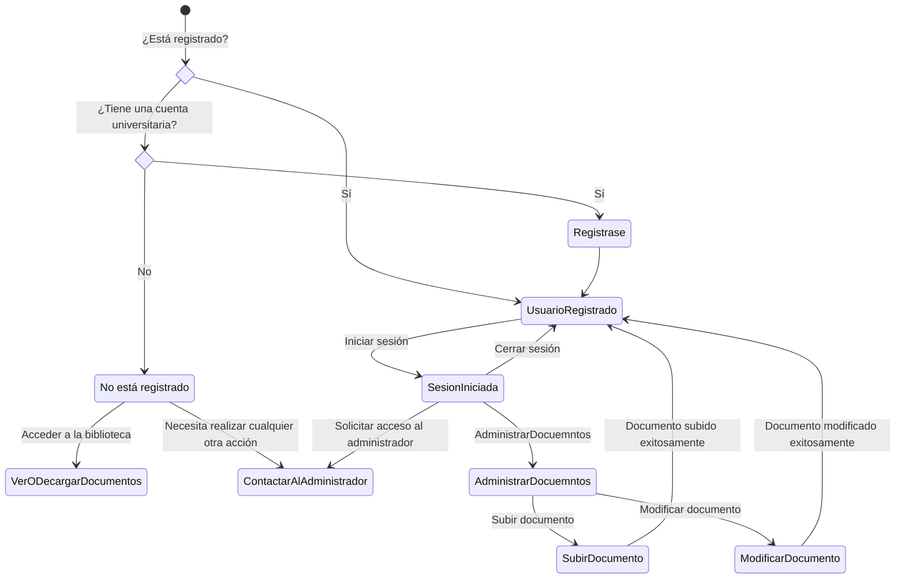

```mermaid
stateDiagram-v2
    state estaRegistrado <<choice>>
    state tieneCuentaUniversitaria <<choice>>
    [*] --> estaRegistrado : ¿Está registrado?
    estaRegistrado --> UsuarioRegistrado : Sí
    estaRegistrado --> tieneCuentaUniversitaria : ¿Tiene una cuenta universitaria?
    tieneCuentaUniversitaria --> Registrase : Sí
    Registrase --> UsuarioRegistrado
    tieneCuentaUniversitaria --> UsuarioNoRegistrado : No
    UsuarioNoRegistrado : No está registrado
    UsuarioNoRegistrado --> VerODecargarDocumentos : Acceder a la biblioteca
    UsuarioNoRegistrado --> ContactarAlAdministrador : Necesita realizar cualquier otra acción
    UsuarioRegistrado --> SesionIniciada : Iniciar sesión
    SesionIniciada --> UsuarioRegistrado : Cerrar sesión
    SesionIniciada --> ContactarAlAdministrador : Solicitar acceso al administrador
    SesionIniciada --> AdministrarDocuemntos : AdministrarDocuemntos
    AdministrarDocuemntos --> SubirDocumento : Subir documento
    AdministrarDocuemntos --> ModificarDocumento : Modificar documento
    SubirDocumento --> UsuarioRegistrado : Documento subido exitosamente
    ModificarDocumento --> UsuarioRegistrado : Documento modificado exitosamente

```