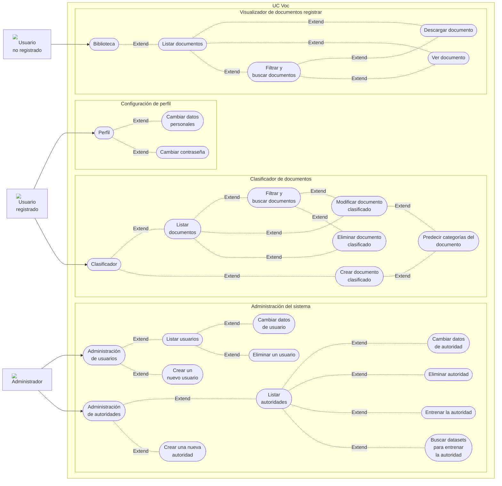
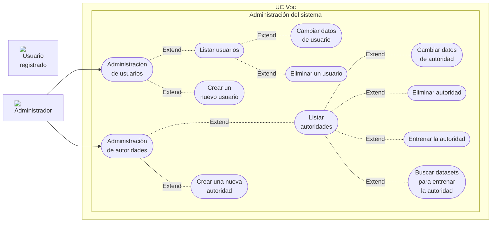
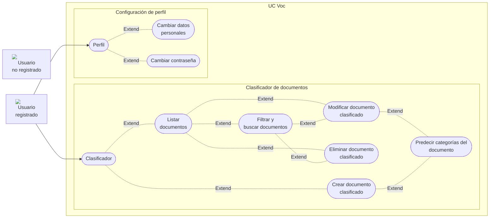
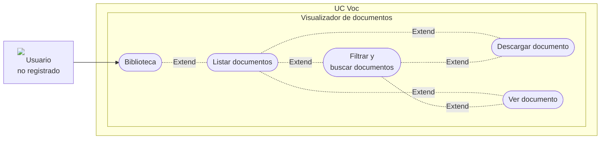

```mermaid
%%{init: {'theme': 'default'}}%%
graph LR
UsuarioNoRegistrado[<img src='./readme_imgs/monigote.png'> Usuario
no registrado]
UsuarioRegistrado[<img src='./readme_imgs/monigote.png'> Usuario
registrado]
Administrador[<img src='./readme_imgs/monigote.png'> Administrador]

subgraph UC Voc
    subgraph Administración del sistema
        AdministraciónUsuarios([Administración
        de usuarios])
        CambiarDatosUsuario([Cambiar datos
        de usuario])
        CrearNuevoUsuario([Crear un
        nuevo usuario])
        EliminarUsuario([Eliminar un usuario])
        AdministraciónAutoridades([Administración
        de autoridades])
        ListarAutoridades([Listar
        autoridades])
        CambiarDatosAutoridad([Cambiar datos
        de autoridad])
        CrearNuevaAutoridad([Crear una nueva
        autoridad])
        EliminarAutoridad([Eliminar autoridad])
        ListarUsuarios([Listar usuarios])
        EntrenarAutoridad([Entrenar la autoridad])
        BuscarDatosEntrenamiento([Buscar datasets
        para entrenar
        la autoridad])
    end
    subgraph Clasificador de documentos
        Clasificador([Clasificador])
        ListarDocumentosAlt([Listar
        documentos])
        FiltrarBuscarDocumentosAlt([Filtrar y
        buscar documentos])
        ModificarDocumento([Modificar documento
        clasificado])
        EliminarDocumento([Eliminar documento
        clasificado])
        CrearDocumentoClasificado([Crear documento
        clasificado])
        PredecirCategorias([Predecir categorías del
        documento])
    end
    subgraph Configuración de perfil
        Perfil([Perfil])
        CambiarDatosPersonales([Cambiar datos
        personales])
        CambiarContraseña([Cambiar contraseña])
    end
    subgraph Visualizador de documentos registrar
        Biblioteca([Biblioteca])
        ListarDocumentos([Listar documentos])
        FiltrarBuscarDocumentos([Filtrar y
        buscar documentos])
        DescargarDocumento([Descargar documento])
        VerDocumento([Ver documento])
    end
end

UsuarioNoRegistrado-->Biblioteca

UsuarioRegistrado--> Perfil


UsuarioRegistrado--> Clasificador

Administrador--> AdministraciónUsuarios

Administrador--> AdministraciónAutoridades


Biblioteca-.Extend.- ListarDocumentos

ListarDocumentos -.Extend.-  DescargarDocumento
ListarDocumentos -.Extend.-  VerDocumento
ListarDocumentos -.Extend.-  FiltrarBuscarDocumentos

FiltrarBuscarDocumentos -.Extend..-  DescargarDocumento
FiltrarBuscarDocumentos -.Extend..-  VerDocumento

Perfil-.Extend.- CambiarDatosPersonales
Perfil-.Extend.- CambiarContraseña

ListarUsuarios-.Extend.- CambiarDatosUsuario
ListarUsuarios-.Extend.- EliminarUsuario

AdministraciónUsuarios-.Extend.- ListarUsuarios
AdministraciónUsuarios-.Extend.- CrearNuevoUsuario

AdministraciónAutoridades-.Extend..- ListarAutoridades
AdministraciónAutoridades-.Extend.- CrearNuevaAutoridad

ListarAutoridades-.Extend..- CambiarDatosAutoridad
ListarAutoridades-.Extend..- EliminarAutoridad
ListarAutoridades-.Extend..- EntrenarAutoridad
ListarAutoridades-.Extend..- BuscarDatosEntrenamiento


Clasificador -.Extend.- ListarDocumentosAlt
Clasificador -.Extend.- CrearDocumentoClasificado
ListarDocumentosAlt-.Extend.- FiltrarBuscarDocumentosAlt
ListarDocumentosAlt-.Extend.- ModificarDocumento
FiltrarBuscarDocumentosAlt-.Extend.- ModificarDocumento
ListarDocumentosAlt-.Extend.- EliminarDocumento
FiltrarBuscarDocumentosAlt-.Extend.- EliminarDocumento
ModificarDocumento-.Extend.- PredecirCategorias
CrearDocumentoClasificado-.Extend.- PredecirCategorias
```

```mermaid
%%{init: {'theme': 'default'}}%%
graph LR
UsuarioRegistrado[<img src='./readme_imgs/monigote.png'> Usuario
registrado]
Administrador[<img src='./readme_imgs/monigote.png'> Administrador]

subgraph UC Voc
    subgraph Administración del sistema
        AdministraciónUsuarios([Administración
        de usuarios])
        CambiarDatosUsuario([Cambiar datos
        de usuario])
        CrearNuevoUsuario([Crear un
        nuevo usuario])
        EliminarUsuario([Eliminar un usuario])
        AdministraciónAutoridades([Administración
        de autoridades])
        ListarAutoridades([Listar
        autoridades])
        CambiarDatosAutoridad([Cambiar datos
        de autoridad])
        CrearNuevaAutoridad([Crear una nueva
        autoridad])
        EliminarAutoridad([Eliminar autoridad])
        ListarUsuarios([Listar usuarios])
        EntrenarAutoridad([Entrenar la autoridad])
        BuscarDatosEntrenamiento([Buscar datasets
        para entrenar
        la autoridad])
    end
end


Administrador--> AdministraciónUsuarios

Administrador--> AdministraciónAutoridades


ListarUsuarios-.Extend.- CambiarDatosUsuario
ListarUsuarios-.Extend.- EliminarUsuario

AdministraciónUsuarios-.Extend.- ListarUsuarios
AdministraciónUsuarios-.Extend.- CrearNuevoUsuario

AdministraciónAutoridades-.Extend..- ListarAutoridades
AdministraciónAutoridades-.Extend.- CrearNuevaAutoridad

ListarAutoridades-.Extend..- CambiarDatosAutoridad
ListarAutoridades-.Extend..- EliminarAutoridad
ListarAutoridades-.Extend..- EntrenarAutoridad
ListarAutoridades-.Extend..- BuscarDatosEntrenamiento

```

```mermaid
%%{init: {'theme': 'default'}}%%
graph LR
UsuarioNoRegistrado[<img src='./readme_imgs/monigote.png'> Usuario
no registrado]
UsuarioRegistrado[<img src='./readme_imgs/monigote.png'> Usuario
registrado]

subgraph UC Voc
    subgraph Clasificador de documentos
        Clasificador([Clasificador])
        ListarDocumentosAlt([Listar
        documentos])
        FiltrarBuscarDocumentosAlt([Filtrar y
        buscar documentos])
        ModificarDocumento([Modificar documento
        clasificado])
        EliminarDocumento([Eliminar documento
        clasificado])
        CrearDocumentoClasificado([Crear documento
        clasificado])
        PredecirCategorias([Predecir categorías del
        documento])
    end
    subgraph Configuración de perfil
        Perfil([Perfil])
        CambiarDatosPersonales([Cambiar datos
        personales])
        CambiarContraseña([Cambiar contraseña])
    end
end


UsuarioRegistrado--> Perfil


UsuarioRegistrado--> Clasificador

Perfil-.Extend.- CambiarDatosPersonales
Perfil-.Extend.- CambiarContraseña


Clasificador -.Extend.- ListarDocumentosAlt
Clasificador -.Extend.- CrearDocumentoClasificado
ListarDocumentosAlt-.Extend.- FiltrarBuscarDocumentosAlt
ListarDocumentosAlt-.Extend.- ModificarDocumento
FiltrarBuscarDocumentosAlt-.Extend.- ModificarDocumento
ListarDocumentosAlt-.Extend.- EliminarDocumento
FiltrarBuscarDocumentosAlt-.Extend.- EliminarDocumento
ModificarDocumento-.Extend.- PredecirCategorias
CrearDocumentoClasificado-.Extend.- PredecirCategorias
```

```mermaid
%%{init: {'theme': 'default'}}%%
graph LR
UsuarioNoRegistrado[<img src='./readme_imgs/monigote.png'> Usuario
no registrado]

subgraph UC Voc
    subgraph Visualizador de documentos
        Biblioteca([Biblioteca])
        ListarDocumentos([Listar documentos])
        FiltrarBuscarDocumentos([Filtrar y
        buscar documentos])
        DescargarDocumento([Descargar documento])
        VerDocumento([Ver documento])
    end
end

UsuarioNoRegistrado-->Biblioteca


Biblioteca-.Extend.- ListarDocumentos

ListarDocumentos -.Extend.-  DescargarDocumento
ListarDocumentos -.Extend.-  VerDocumento
ListarDocumentos -.Extend.-  FiltrarBuscarDocumentos

FiltrarBuscarDocumentos -.Extend..-  DescargarDocumento
FiltrarBuscarDocumentos -.Extend..-  VerDocumento

```
